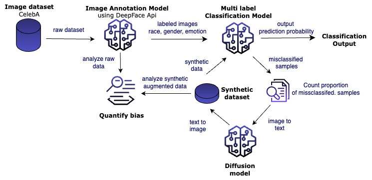

# Unveiling Fairness: A Framework for Bias Identification and Mitigation in Facial Image Datasets

Bias identification and mitigation in visual datasets

## Table of Contents

- [Introduction](#introduction)
- [Getting Started](#getting-started)

## Introduction

In the era of data-driven decision-support systems, the enhancement of decision-making across diverse sectors has been remarkable. However, the unintended consequences of these systems can arise from the biases inherently present in the data, leading to unfair outcomes. This research delves into the crucial task of addressing biases within facial expression, gender, and race recognition. Specifically, the study centers on leveraging the CelebA dataset to develop a framework for bias identification and mitigation.

The proposed framework involves generating synthetic data using a stable diffusion model. The central focus is on understanding how the augmentation of training data influences the performance of classifiers. This augmentation aims to mitigate biases related to the protected attributes present in the data, ultimately promoting more equitable outcomes.

<div style="text-align: center;">
    
</div>
The pipeline commences with the annotation of the CelebA image dataset. Leveraging the deepface API, the dataset is enriched with annotations that capture protected attributes such as race and gender. Subsequently, a comprehensive evaluation of the classifier is conducted to identify instances that are misclassified due to biases.

The misclassified samples serve as the foundation for a stable diffusion model. This model generates synthetic data that effectively incorporates the patterns of the misclassified instances. The synthesized data is then seamlessly integrated into the original dataset, augmenting it with original data. A rigorous analysis of the classifier's performance is executed before and after this data augmentation process. This evaluation is pivotal in gauging the impact of data augmentation on classification accuracy and bias mitigation.

## Getting Started

To set up and run the project on your local machine, follow these instructions:

1. Install required dependencies using the following command:

```bash
pip install -r requirements.txt
```
2. Ensure that your Python version is greater than 3.6, as the stable diffusion model relies on this version.
3. Run the file './Analytics/Data Pipeline.ipynb' to observe the outcomes before and after data augmentation. You have the flexibility to choose between different models (e.g., VGGNet, GoogLeNet, ResNet) and analyze their performance in response to data augmentation.


### Prerequisites

List any prerequisites or software that needs to be installed before getting started.

For the stable diffusion model, the python version should be > 3.6

Run the file  `'./Analytics/Data Pipeline.ipynb'` to observe output before and after data augmentation. The default model is vggnet. You can change it to googlenet or resnet to see the impact of data augmentation on each model performance separately.


